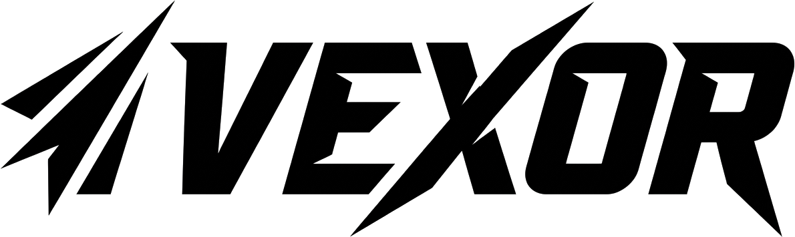

<div align="center">
  

  <br />
  <br />

  <strong>A single-tenant, internal ERP for managing football jersey inventory and invoicing.</strong>

  <br />
  <br />

  
  
  
  
  

</div>

---

## 📖 Overview

**Vexor** is an internal, single-tenant Enterprise Resource Planning (ERP) system custom-built for a football jersey retailer operating in Bangladesh. 

The system streamlines two core workflows:
1. **Inventory Management**: Managing jersey catalog, tracking SKUs, sizes, and stock levels.
2. **Order & Invoicing**: Creating customer orders that atomically decrement stock, generate PDF invoices, and dispatch automatic email deliveries.

Customers are passive in this system—they receive invoices but never log in. The only authenticated user is the shop seller.

---

## ✨ Core Features

- **Atomic Transactions**: Confirming an invoice, decrementing stock, generating a PDF, and emailing the customer are all handled in a single atomic action to prevent data inconsistency.
- **Automated PDF Generation**: Generates pixel-perfect, brutalist-styled PDF invoices dynamically.
- **Inventory & SKU Management**: Real-time stock tracking with low-stock alerts.
- **Dashboard Analytics**: Visualize daily revenue, profit margins, and top-selling products using interactive charts.
- **Secure Authentication**: Single-account system provisioned via a secure CLI script, with JWT-based sessions.

---

## 🛠️ Technology Stack

### Frontend
- **Framework**: React 18 (Vite)
- **Styling**: Tailwind CSS (Custom Brutalist Design System)
- **State Management**: Zustand (Auth/Active Invoice) & TanStack React Query (Server State)
- **Forms**: React Hook Form + Zod
- **Data Visualization**: Recharts

### Backend
- **Runtime**: Node.js 20
- **Framework**: Express.js
- **Database**: MongoDB (Replica Set enabled for multi-document transactions)
- **Caching/Queues**: Redis (ioredis)
- **Validation**: Zod
- **PDF Generation**: `@react-pdf/renderer`

---

## 🚀 Getting Started

### Prerequisites
- Node.js 20+
- MongoDB 6.0+ (Must be configured as a Replica Set)
- Redis Server

### Installation

1. **Clone the repository:**
   ```bash
   git clone https://github.com/MURTAYES/vexor.git
   cd vexor
   ```

2. **Backend Setup:**
   ```bash
   npm install
   # Configure your .env file with MongoDB URI, JWT Secret, and Email credentials
   npm run dev
   ```

3. **Frontend Setup:**
   ```bash
   cd frontend
   npm install
   npm run dev
   ```

4. **Provision Initial Seller Account:**
   Run the CLI seed script to create the single seller account:
   ```bash
   node scripts/createSeller.js
   ```

---

<div align="center">
  
</div>
